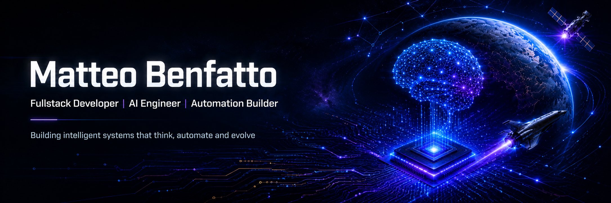
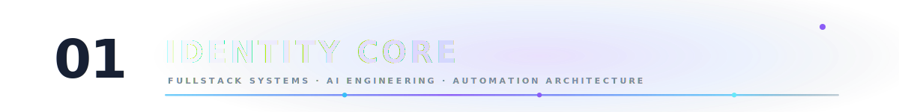
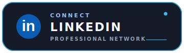
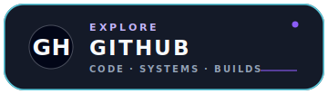
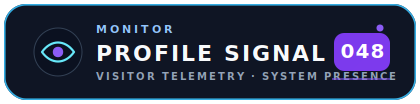

<!-- HERO -->
<div align="center">



<br/><br/>


<br/><br/>
<br/>

<div align="center">



</div>

<br/>



<br/><br/>


<br/>

<a href="https://linkedin.com/in/matteobenfatto97">
  
</a>
&nbsp;
<a href="https://github.com/matteobenfatto97">
  
</a>
&nbsp;
<a href="mailto:matteo.benfatto97@gmail.com">
  
</a>
<br/>

<div align="center">
  
</div>
<br/>
</div>
<div align="center">

</div>

```ts
const matteo: DeveloperProfile = {
  name: "Matteo Benfatto",
  role: "Fullstack Developer & AI Engineer",
  location: "Italy",

  mindset: "build fast, automate deeply, think systemically",

  specialization: [
    "AI-powered applications",
    "Fullstack product development",
    "Automation systems",
    "API-first architectures",
    "Cloud-ready software"
  ],

  stack: {
    languages: ["Python", "TypeScript", "JavaScript"],
    frontend: ["React", "Next.js", "Tailwind CSS"],
    backend: ["FastAPI", "Node.js", "REST APIs"],
    data: ["PostgreSQL", "Redis", "MongoDB"],
    devOps: ["Docker", "GitHub Actions", "Linux"],
    ai: ["LLMs", "AI Agents", "Automation Pipelines"]
  },

  mission:
    "turn complex ideas into elegant, intelligent and scalable software",
};
```

<div align="center">


</div>

## ✨ Tech Constellation

<div align="center">

> My stack is not a random collection of tools.  
> It is the constellation I use to build intelligent, scalable and elegant software.

<br/>

### 🧠 Core Engineering


<br/><br/>

### ⚡ Backend, APIs & Automation


<br/><br/>

### 🤖 AI, Data & Intelligent Systems


<br/><br/>

### ☁️ Cloud, DevOps & Workflow


<br/><br/>

### 🛠️ Tools


</div>


## 🚀 Project Galaxy

<div align="center">



</div>


## 📊 GitHub Signals

<div align="center">


<br/><br/>


<br/><br/>


</div>


## 🧩 Engineering Doctrine

```txt
> Think in systems.
> Build in iterations.
> Automate the boring.
> Polish the meaningful.
> Make software feel alive.
```

I like software that is not just technically correct, but useful, elegant and alive.

Good engineering means connecting logic, design and purpose:  
a clean interface, a solid architecture, an intelligent workflow and a real problem solved.


## 🧪 Current Orbit

```yaml
learning:
  - advanced AI engineering
  - software architecture
  - automation design
  - scalable backend systems

building:
  - AI-powered productivity tools
  - fullstack applications
  - API-first products
  - automation workflows

obsessed_with:
  - elegant code
  - intelligent systems
  - fast execution
  - meaningful products
```


## 🛰️ Operating Mode

<table>
<tr>
<td width="25%" align="center">

### Analyze

Understand the real problem before touching the keyboard.

</td>
<td width="25%" align="center">

### Design

Create clean structures, usable interfaces and maintainable flows.

</td>
<td width="25%" align="center">

### Build

Move fast, ship concretely and keep the architecture alive.

</td>
<td width="25%" align="center">

### Automate

Remove friction, connect systems and let software do the heavy work.

</td>
</tr>
</table>


<div align="center">

## 🌠 Final Transmission

I am always interested in projects where software meets intelligence, automation and real-world impact.

<br/>

> Building intelligent systems.  
> Engineering ideas into living software.  


<br/>


</div>

