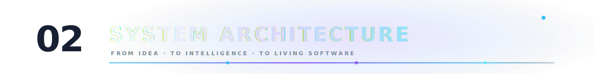
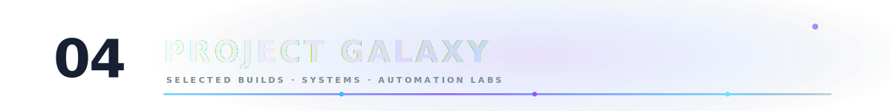
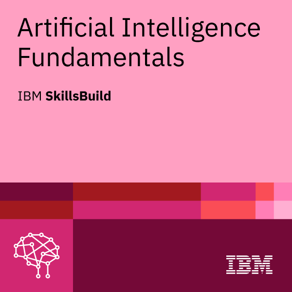
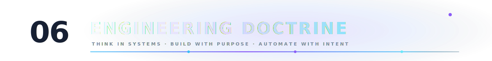

<!-- HERO -->
<div align="center">
<p align="center">
  
</p>
<br/><br/>


<br/><br/>
<br/>

<div align="center">


</div>

<br/>


<br/><br/>


<br/>

<a href="https://linkedin.com/in/benfattomatteo">
  
</a>
&nbsp;
<a href="https://github.com/benfattomatteo">
  
</a>
&nbsp;
<a href="mailto:matteo.benfatto97@gmail.com">
  
</a>
<br/>

<div align="center">
  
</div>


</div>

<br/>

```ts
const matteo = {

  identity: {
    name: "Matteo Benfatto",
    role: "Fullstack Developer · ML/AI Engineer · Automation Builder",
    origin: "Italy",
  },

  systemMode: {
    mindset: "build fast, automate deeply, think systemically",
    principle:
      "software should not only run — it should understand, connect and evolve",
    method:
      "transform complexity into structure, structure into automation, automation into leverage",
    standard:
      "premium interfaces, clean architectures, intelligent workflows"
  },

  buildDomains: {
    intelligence: [
      "AI-powered applications",
      "LLM workflows",
      "AI agents",
      "automation pipelines"
    ],

    product: [
      "fullstack web applications",
      "API-first platforms",
      "cloud-ready systems",
      "dashboard experiences"
    ],

    perception: [
      "machine learning experiments",
      "computer vision pipelines",
      "object detection",
      "visual intelligence"
    ],

    automation: [
      "workflow engines",
      "service integrations",
      "scheduled actions",
      "productivity systems"
    ]
  },
  mission:
    "engineer ideas into living software with intelligence, automation and purpose"
};
```

<br/>

<div align="center">
<div align="center">
  
</div>


</div>

<div align="center">
  
</div>

<div align="center">

> My stack is not a random collection of tools.  
> It is the constellation I use to build intelligent software, AI systems, machine vision pipelines and scalable digital products.

<br/>


<br/>


<br/><br/>


<br/>


<br/><br/>


<br/>


<br/><br/>



<br/><br/>


<br/>


<br/><br/>


<br/>


</div>


<div align="center">
  
</div>

<div align="center">


</div>


<div align="center">


<br/>

<table>
<tr>
<td width="24%" align="center">

<a href="INSERISCI_LINK_CREDENZIALE">
  
</a>

</td>
<td width="76%" align="left">

<p><strong>VERIFIED CREDENTIAL // IBM SKILLSBUILD</strong></p>

<h2>Artificial Intelligence Fundamentals</h2>

<p>
A foundational credential focused on AI concepts, intelligent software systems and emerging machine vision workflows.
</p>

<p>
  <code>Artificial Intelligence</code>
  <code>Machine Vision</code>
  <code>Intelligent Systems</code>
  <code>AI Foundations</code>
</p>

<a href="https://www.credly.com/badges/4e1a41ce-f000-4444-a3a5-6e4c1cc1e508/public_url">
  <strong>VERIFY CREDENTIAL ↗</strong>
</a>

</td>
</tr>
</table>

</div>


<div align="center">


<br/>


<br/><br/>

<sub>GitHub activity data may be cached by external rendering services.</sub>

</div>


<div align="center">
  
</div>

```txt
> Think in systems.
> Build in iterations.
> Automate the boring.
> Polish the meaningful.
> Make software feel alive.
```

I like software that is not just technically correct, but useful, elegant and alive.

Good engineering means connecting logic, design and purpose:  
a clean interface, a solid architecture, an intelligent workflow and a real problem solved.


<div align="center">
  
</div>

```yaml
learning:
  - advanced AI engineering
  - software architecture
  - automation design
  - scalable backend systems

building:
  - AI-powered productivity tools
  - fullstack applications
  - API-first products
  - automation workflows

obsessed_with:
  - elegant code
  - intelligent systems
  - fast execution
  - meaningful products
```


<br/>

<div align="center">



</div>
